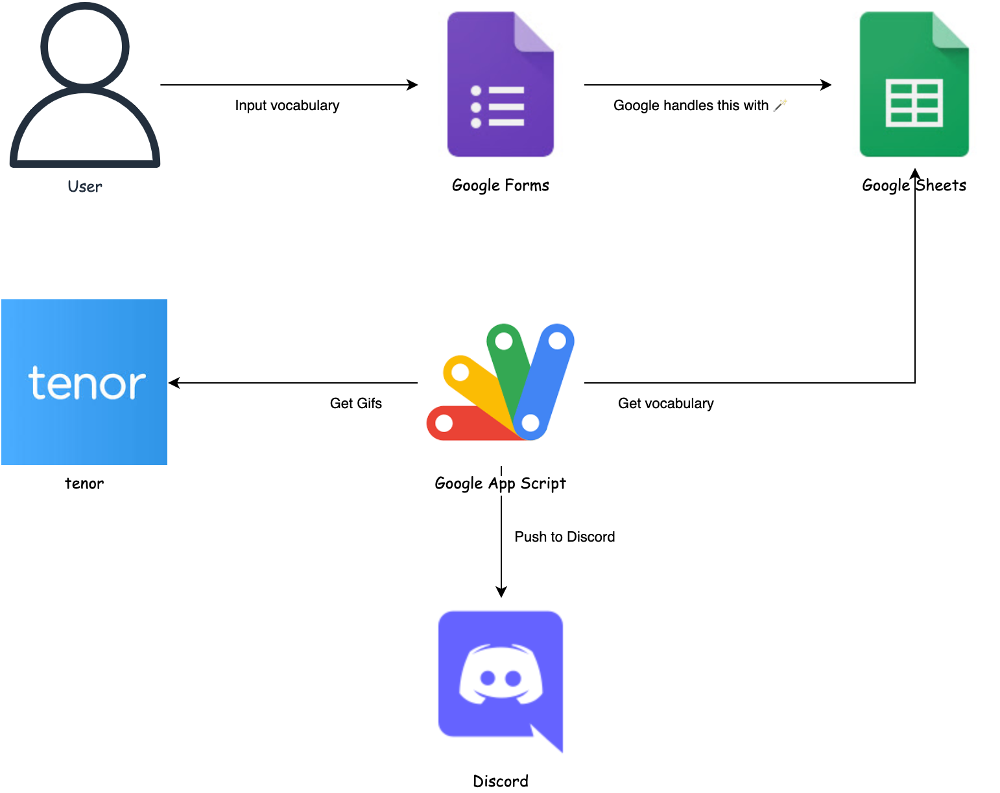

# review-vocabulary-everyday

- A Solution to review at least one vocabulary everyday to improve language skills.

## Basic idea

- Make your own dictionary manually, push notification to Discord automatically.
  - Put your daily things into dictionary: news, music, moive, books, etc.

## Introducing Characters

- Discord
  - Support iOS, Android, Windows, Mac, Web, etc.
  - The explanation can be masked before you click.
- Tenor API
  - Gifs make you memorize new words faster.
  - Learn with culture and meme.
- Google Forms
  - Input the words that you want to remember manually.
  - Create Google Sheets, you can analyze data easily.
- Google Apps Script
  - Set triggers to execute script automatically.
  - Send data (your vocabulary) on Google Sheets (Forms) to Discord.

## Demo

## Usage
