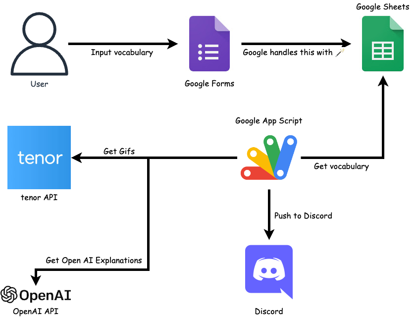

# review-vocabulary-everyday

- A Solution to review at least one vocabulary everyday to improve language skills.

## Basic idea

- Make your own dictionary manually, push notification to Discord automatically.
  - Put your daily things into dictionary: news, music, moive, books, etc.

## Introducing Characters

- Discord
  - Support iOS, Android, Windows, Mac, Web, etc.
  - The explanation can be masked before you click.
- Tenor API
  - Gifs make you memorize new words faster.
  - Learn with culture and meme.
- Open AI API
  - Explain the words/sentences with gpt-3.5-turbo models.
  - Act as an English Translator and Improver.
    - The idea is inspired from [Awesome ChatGPT Prompts](https://github.com/f/awesome-chatgpt-prompts#act-as-an-english-translator-and-improver)
- Google Forms
  - Input the words that you want to remember manually.
  - Create Google Sheets, you can analyze data easily.
- Google Apps Script
  - Set triggers to execute script automatically.
  - Send data (your vocabulary) on Google Sheets (Forms) to Discord.

## Demo

https://user-images.githubusercontent.com/30837573/217538782-e8b1ba09-af31-49c8-a5d9-897726db2df5.MP4

## Usage

### You need to have

- Google account
- Discord account
- OpenAI account

### Steps

1. [Design the Google Forms and Google Sheets.](docs/google_forms_sheets.md)
2. [Get the Discord channel webhook.](docs/discord_webhook.md)
3. [Get the Tenor API key.](docs/tenor_api_key.md)
4. [Get the OpenAI API key.](docs/openai_api_key.md)
5. [Upload the codes to Google Apps Script.](docs/google_apps_script.md)
